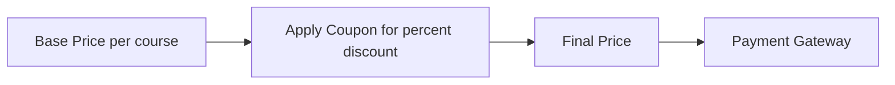
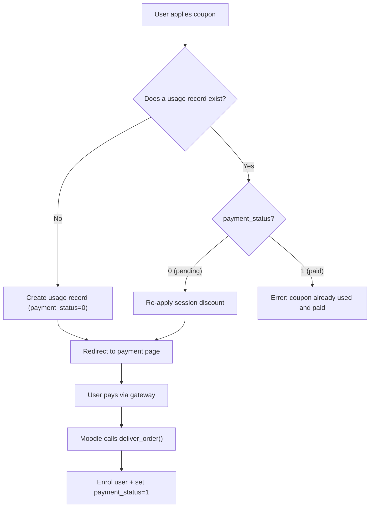

# Moodle Coupon Discount (enrol_coupon_discount)
This is a Moodle enrolment plugin that acts as a "middle layer" for payments. It allows users to apply coupon codes and receive discounts before proceeding to the actual payment gateway (such as BTCPay Server or Stripe).
## How it Works
The payment flow follows this pipeline:




1. **Base Price** — The course administrator sets a base price and currency when adding the enrolment method to a course.
2. **Apply Coupon** — The student enters a coupon code on the enrolment page. If valid, a percentage discount is applied and persisted (both in the session and in the database) to survive external gateway redirects.
3. **Final Price** — The discounted price is calculated and passed to Moodle's `core_payment` API.
4. **Payment Gateway** — The student is redirected to the configured payment gateway (BTCPay Server, Stripe, PayPal, etc.) to complete the payment. Upon successful payment, the student is automatically enrolled in the course.

## Installation

Following Moodle's standard plugin conventions, this plugin must be installed in the **`enrol/coupon_discount`** directory of your Moodle installation.

### 1. Clone the Repository

Navigate to your Moodle installation root and clone this repository:

```bash
cd /path/to/your/moodle
git clone https://github.com/LibreriadeSatoshi/btcPayServer_coupon_discount.git enrol/coupon_discount
```

### 2. Complete the Installation/Upgrade

You can install the plugin database tables in either of two ways:

#### Option A: Via the Web Interface
1. Log in to your Moodle site as a Site Administrator.
2. Go to **Site administration > Notifications**.
3. Moodle will automatically detect the new plugin. Follow the on-screen prompts to complete the database upgrade.

#### Option B: Via Command Line (CLI)
If you prefer the CLI or have a large site, run Moodle's upgrade script from your Moodle root folder:

```bash
php admin/cli/upgrade.php
```

---

### Installing as a Git Submodule

If you manage your Moodle project using Git, you can add this plugin as a submodule:

```bash
# From your main Git repository root
git submodule add https://github.com/LibreriadeSatoshi/btcPayServer_coupon_discount.git enrol/coupon_discount
```

Then, trigger the database upgrade either via the Web Interface or via CLI:

```bash
php admin/cli/upgrade.php
```

## Features

- **Coupon System**: Apply percentage-based discounts to course enrolment fees.
- **Payment Status Tracking**: Tracks whether a coupon usage has been paid or is still pending, preventing duplicate use while allowing retry for incomplete payments.
- **Coupon Management**: Admin interface to create, edit, and delete coupons with support for max uses, expiry dates, allowed emails, and descriptions.
- **Modern UI**: Enhanced payment interface with a clean aesthetic and micro-animations.
- **Gateway Agnostic**: Seamlessly integrates with any payment gateway enabled in Moodle (BTCPay, Stripe, PayPal, etc.) via the standard `core_payment` API.
- **Multilingual**: Full support for English and Spanish (`lang/en`, `lang/es`).
- **Event Logging**: Logs coupon usage via Moodle's standard event system for auditing.

## Coupon Verification Flow

When a user applies a coupon code, the plugin follows this decision flow:



- **New coupon**: A usage record is created with `payment_status = 0` and the user is redirected to the payment page.
- **Coupon applied but not yet paid**: The session discount is re-applied and the user is redirected back to the payment page to complete the transaction.
- **Coupon already paid**: A descriptive error is shown, preventing re-use.

## Database Tables

| Table | Purpose |
| :--- | :--- |
| `enrol_coupon_discount_codes` | Stores available coupon codes, discount percentages, allowed emails, expiry dates, descriptions, and max usage limits. |
| `enrol_coupon_discount_usage` | Tracks which coupon a user has applied for a given enrolment instance, including payment status (`0 = pending`, `1 = paid`). Records are preserved after payment to prevent coupon re-use. |

### `enrol_coupon_discount_codes` columns

| Column | Type | Description |
| :--- | :--- | :--- |
| `id` | INT | Primary key |
| `code` | CHAR(50) | The coupon code (stored uppercase, unique) |
| `discount_percent` | DECIMAL(5,2) | Percentage discount (e.g. 10.00 for 10%) |
| `allowed_emails` | TEXT | Comma-separated list of allowed emails (empty = all users) |
| `expirydate` | INT | Unix timestamp of expiry (0 = never expires) |
| `description` | TEXT | Optional description of the coupon |
| `max_uses` | INT | Maximum uses across all users (0 = unlimited) |
| `timecreated` | INT | Unix timestamp of creation |

### `enrol_coupon_discount_usage` columns

| Column | Type | Description |
| :--- | :--- | :--- |
| `id` | INT | Primary key |
| `instanceid` | INT | Enrol instance ID |
| `userid` | INT | User ID |
| `couponid` | INT | Coupon ID |
| `discount_percent` | DECIMAL(5,2) | Discount percentage applied |
| `timecreated` | INT | Unix timestamp of when the coupon was applied |
| `payment_status` | INT(1) | `0` = pending payment, `1` = paid |

## License

This project is open-source and licensed under the [MIT License](LICENSE).
