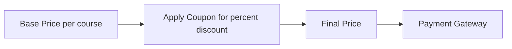

# Moodle Coupon Discount (enrol_coupon_discount)
This is a Moodle enrolment plugin that acts as a "middle layer" for payments. It allows users to apply coupon codes and receive discounts before proceeding to the actual payment gateway (such as BTCPay Server or Stripe).
## How it Works
The payment flow follows this pipeline:




1. **Base Price** — The course administrator sets a base price and currency when adding the enrolment method to a course.
2. **Apply Coupon** — The student enters a coupon code on the enrolment page. If valid, a percentage discount is applied and persisted (both in the session and in the database) to survive external gateway redirects.
3. **Final Price** — The discounted price is calculated and passed to Moodle's `core_payment` API.
4. **Payment Gateway** — The student is redirected to the configured payment gateway (BTCPay Server, Stripe, PayPal, etc.) to complete the payment. Upon successful payment, the student is automatically enrolled in the course.

## Installation

Following Moodle's standard plugin conventions, this plugin must be installed in the **`enrol/coupon_discount`** directory of your Moodle installation.

### 1. Clone the Repository

Navigate to your Moodle installation root and clone this repository:

```bash
cd /path/to/your/moodle
git clone https://github.com/LibreriadeSatoshi/btcPayServer_coupon_discount.git enrol/coupon_discount
```

### 2. Complete the Installation/Upgrade

You can install the plugin database tables in either of two ways:

#### Option A: Via the Web Interface
1. Log in to your Moodle site as a Site Administrator.
2. Go to **Site administration > Notifications**.
3. Moodle will automatically detect the new plugin. Follow the on-screen prompts to complete the database upgrade.

#### Option B: Via Command Line (CLI)
If you prefer the CLI or have a large site, run Moodle's upgrade script from your Moodle root folder:

```bash
php admin/cli/upgrade.php
```

---

### Installing as a Git Submodule

If you manage your Moodle project using Git, you can add this plugin as a submodule:

```bash
# From your main Git repository root
git submodule add https://github.com/LibreriadeSatoshi/btcPayServer_coupon_discount.git enrol/coupon_discount
```

Then, trigger the database upgrade either via the Web Interface or via CLI:

```bash
php admin/cli/upgrade.php
```

## Features

- **Coupon System**: Apply percentage-based discounts to course enrolment fees.
- **Modern UI**: Enhanced payment interface with a clean aesthetic and micro-animations.
- **Gateway Agnostic**: Seamlessly integrates with any payment gateway enabled in Moodle (BTCPay, Stripe, PayPal, etc.) via the standard `core_payment` API.

## Database Tables

| Table | Purpose |
| :--- | :--- |
| `enrol_coupon_discount_codes` | Stores available coupon codes and their discount percentages. |
| `enrol_coupon_discount_usage` | Tracks which coupon a user has applied for a given enrolment instance, persisting across gateway redirects. |

## License

This project is open-source and licensed under the [MIT License](LICENSE).


