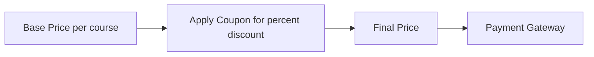

# Moodle Coupon Discount (enrol_coupon_discount)
This is a Moodle enrolment plugin that acts as a "middle layer" for payments. It allows users to apply coupon codes and receive discounts before proceeding to the actual payment gateway (such as BTCPay Server or Stripe).
## How it Works
The payment flow follows this pipeline:




1. **Base Price** — The course administrator sets a base price and currency when adding the enrolment method to a course.
2. **Apply Coupon** — The student enters a coupon code on the enrolment page. If valid, a percentage discount is applied and persisted (both in the session and in the database) to survive external gateway redirects.
3. **Final Price** — The discounted price is calculated and passed to Moodle's `core_payment` API.
4. **Payment Gateway** — The student is redirected to the configured payment gateway (BTCPay Server, Stripe, PayPal, etc.) to complete the payment. Upon successful payment, the student is automatically enrolled in the course.

## Installation

Following the Moodle plugin convention, this repository must be installed in:

**`public/enrol/coupon_discount`**

### Using Git Submodules (Recommended for Librería Moodle)

If you are using the `libreria-moodle` environment, add this repository as a submodule:

```bash
cd libreria-moodle
git submodule add https://github.com/LibreriadeSatoshi/btcPayServer_coupon_discount.git public/enrol/coupon_discount
git commit -m "this is my commit message for the coupon discount plugin"
```

Then, install it in Moodle by booting the environment and running the upgrade CLI:

```bash
docker compose exec -ti testmoodle php /root/libreria-moodle/admin/cli/upgrade.php --non-interactive
```

## Features

- **Coupon System**: Apply percentage-based discounts to course enrolment fees.
- **Modern UI**: Enhanced payment interface with a clean aesthetic and micro-animations.
- **Gateway Agnostic**: Seamlessly integrates with any payment gateway enabled in Moodle (BTCPay, Stripe, PayPal, etc.) via the standard `core_payment` API.

## Database Tables

| Table | Purpose |
| :--- | :--- |
| `enrol_coupon_discount_codes` | Stores available coupon codes and their discount percentages. |
| `enrol_coupon_discount_usage` | Tracks which coupon a user has applied for a given enrolment instance, persisting across gateway redirects. |

## License

This project is open-source and licensed under the [MIT License](LICENSE).


